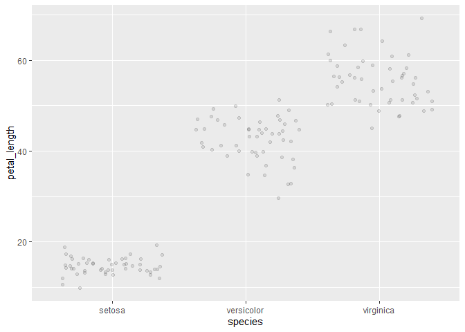
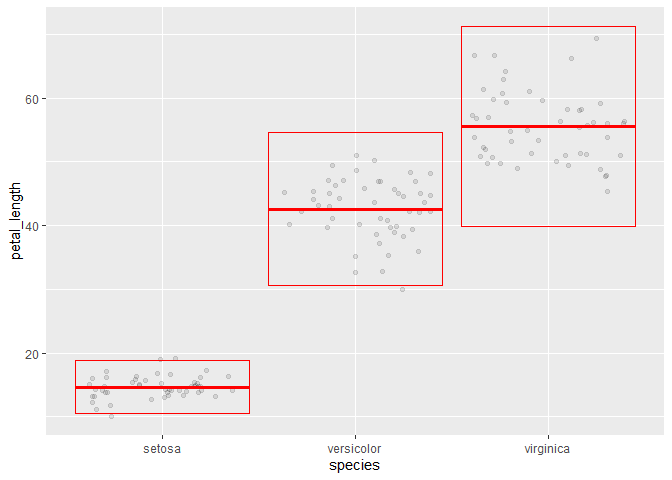
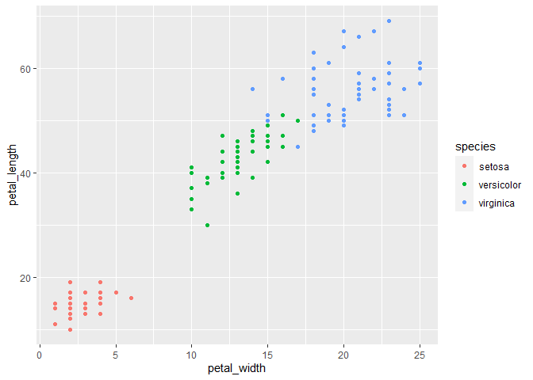

Lab 5
================
Logan Hillers
2021-02-23

# Question 1

Rename each variable so that it is all lower-case and uses an underscore
\_ instead of a period . in the name (the recommended coding style in
the tidyverse style guide). Print the resulting table.

``` r
library(tidyverse)
```

    ## -- Attaching packages --------------------------------------- tidyverse 1.3.0 --

    ## v ggplot2 3.3.3     v purrr   0.3.4
    ## v tibble  3.0.4     v dplyr   1.0.2
    ## v tidyr   1.1.2     v stringr 1.4.0
    ## v readr   1.4.0     v forcats 0.5.0

    ## -- Conflicts ------------------------------------------ tidyverse_conflicts() --
    ## x dplyr::filter() masks stats::filter()
    ## x dplyr::lag()    masks stats::lag()

``` r
iris <- as_tibble(iris)

iris1 <- rename(iris, sepal_length = Sepal.Length, sepal_width = Sepal.Width, petal_length = Petal.Length, petal_width = Petal.Width, species = Species) 

iris1
```

    ## # A tibble: 150 x 5
    ##    sepal_length sepal_width petal_length petal_width species
    ##           <dbl>       <dbl>        <dbl>       <dbl> <fct>  
    ##  1          5.1         3.5          1.4         0.2 setosa 
    ##  2          4.9         3            1.4         0.2 setosa 
    ##  3          4.7         3.2          1.3         0.2 setosa 
    ##  4          4.6         3.1          1.5         0.2 setosa 
    ##  5          5           3.6          1.4         0.2 setosa 
    ##  6          5.4         3.9          1.7         0.4 setosa 
    ##  7          4.6         3.4          1.4         0.3 setosa 
    ##  8          5           3.4          1.5         0.2 setosa 
    ##  9          4.4         2.9          1.4         0.2 setosa 
    ## 10          4.9         3.1          1.5         0.1 setosa 
    ## # ... with 140 more rows

# Question 2

Convert the four numerical variables from cm to mm by multiplying by 10.
Print the resulting table.

``` r
iris2 <- mutate(iris1, sepal_length = sepal_length * 10, sepal_width = sepal_width * 10, petal_length = petal_length * 10, petal_width = petal_width * 10)

iris2
```

    ## # A tibble: 150 x 5
    ##    sepal_length sepal_width petal_length petal_width species
    ##           <dbl>       <dbl>        <dbl>       <dbl> <fct>  
    ##  1           51          35           14           2 setosa 
    ##  2           49          30           14           2 setosa 
    ##  3           47          32           13           2 setosa 
    ##  4           46          31           15           2 setosa 
    ##  5           50          36           14           2 setosa 
    ##  6           54          39           17           4 setosa 
    ##  7           46          34           14           3 setosa 
    ##  8           50          34           15           2 setosa 
    ##  9           44          29           14           2 setosa 
    ## 10           49          31           15           1 setosa 
    ## # ... with 140 more rows

# Question 3

Calculate sepal area and petal area (area is equal to length multiplied
by width). Print a table with only the variables sepal area, petal area,
and species.

``` r
iris3.1 <- mutate(iris2, petal_area = petal_width * petal_length, sepal_area = sepal_width * sepal_length)

iris3.2 <- select(iris3.1, -petal_width, -petal_length, -sepal_length, -sepal_width)

iris3.2
```

    ## # A tibble: 150 x 3
    ##    species petal_area sepal_area
    ##    <fct>        <dbl>      <dbl>
    ##  1 setosa          28       1785
    ##  2 setosa          28       1470
    ##  3 setosa          26       1504
    ##  4 setosa          30       1426
    ##  5 setosa          28       1800
    ##  6 setosa          68       2106
    ##  7 setosa          42       1564
    ##  8 setosa          30       1700
    ##  9 setosa          28       1276
    ## 10 setosa          15       1519
    ## # ... with 140 more rows

# Question 4

Calculate the following statistics for the entire dataset from the sepal
length variable and print the resulting table:

sample size maximum value minimum value range median first quartile (q1)
third quartile (q2) inter-quartile range (iqr)

``` r
iris4.1 <- select(iris2, -petal_width, -petal_length, -sepal_width, -species)

iris4.2 <- summarize(iris4.1, mean_length = mean(sepal_length), maximum_length = max(sepal_length), minimum_length = min(sepal_length), range_length = max(sepal_length) - min(sepal_length), median_length = median(sepal_length), first_quantile = quantile(sepal_length, .25), third_quantile = quantile(sepal_length, .75), interquartile_range = IQR(sepal_length))

iris4.2
```

    ## # A tibble: 1 x 8
    ##   mean_length maximum_length minimum_length range_length median_length
    ##         <dbl>          <dbl>          <dbl>        <dbl>         <dbl>
    ## 1        58.4             79             43           36            58
    ## # ... with 3 more variables: first_quantile <dbl>, third_quantile <dbl>,
    ## #   interquartile_range <dbl>

# Question 5

Calculate the following statistics for each species from the petal width
variable and print the resulting table:

sample size mean standard deviation variance standard error of the mean
approximate 95% confidence interval

``` r
iris5.1 <- select(iris2, -sepal_length, -petal_length, -sepal_width)

iris5.2 <- group_by(iris5.1, species)

iris5.3 <- summarize(iris5.2, sample_size = n(), mean_width = mean(petal_width), standard_deviation = sd(petal_width), variance = var(petal_width), sem = mean(petal_width) / sqrt(sample_size), UCI = mean(petal_width) + (sem * 2), LCI = mean(petal_width) - (sem * 2))
```

    ## `summarise()` ungrouping output (override with `.groups` argument)

``` r
iris5.3
```

    ## # A tibble: 3 x 8
    ##   species    sample_size mean_width standard_deviati~ variance   sem   UCI   LCI
    ##   <fct>            <int>      <dbl>             <dbl>    <dbl> <dbl> <dbl> <dbl>
    ## 1 setosa              50       2.46              1.05     1.11 0.348  3.16  1.76
    ## 2 versicolor          50      13.3               1.98     3.91 1.88  17.0   9.51
    ## 3 virginica           50      20.3               2.75     7.54 2.87  26.0  14.5

# Question 6

Visualize the relationship between petal width and species using a strip
plot.

``` r
iris6.1 <- select(iris3.1, -petal_width, -petal_area, -sepal_area, -sepal_length, -sepal_width)

ggplot(data = iris6.1) +
  geom_jitter(mapping = aes(x = species, y = petal_length), alpha = .1)
```

<!-- -->

# Question 7

Starting with the previous graph, add the mean and 95% confidence
interval for each species

``` r
iris7.1 <- select(iris2, -sepal_length, -petal_width, -sepal_width)

iris7.2 <- group_by(iris7.1, species)

iris7.3 <- summarize(iris7.2, sample_size = n(), mean_length = mean(petal_length), standard_deviation = sd(petal_length), variance = var(petal_length), sem = mean(petal_length) / sqrt(sample_size), UCI = mean(petal_length) + (sem * 2), LCI = mean(petal_length) - (sem * 2))
```

    ## `summarise()` ungrouping output (override with `.groups` argument)

``` r
iris7.4 <- select(iris7.3, -sample_size, -standard_deviation, -variance, -sem)

ggplot(data = iris6.1) +
  geom_jitter(mapping = aes(x = species, y = petal_length), alpha = .1) +
  geom_crossbar(
    data = iris7.4, 
    mapping = aes(x = species, y = mean_length, ymax = UCI, ymin = LCI),
    color = "red"
  )
```

<!-- -->

# Question 8

Visualize the relationship between petal length, petal width, and
species using a scatterplot. Map the two numerical variables to the x
and y axes and map species to the color and shape aesthetics.

``` r
iris8.1 <- select(iris2, -sepal_length, -sepal_width)

ggplot(data = iris8.1) +
  geom_point(mapping = aes(x = petal_width, y = petal_length, color = species))
```

<!-- -->

``` r
sessioninfo::session_info()
```

    ## - Session info ---------------------------------------------------------------
    ##  setting  value                       
    ##  version  R version 4.0.3 (2020-10-10)
    ##  os       Windows 10 x64              
    ##  system   x86_64, mingw32             
    ##  ui       RTerm                       
    ##  language (EN)                        
    ##  collate  English_United States.1252  
    ##  ctype    English_United States.1252  
    ##  tz       America/Chicago             
    ##  date     2021-02-23                  
    ## 
    ## - Packages -------------------------------------------------------------------
    ##  package     * version date       lib source        
    ##  assertthat    0.2.1   2019-03-21 [1] CRAN (R 4.0.3)
    ##  backports     1.2.0   2020-11-02 [1] CRAN (R 4.0.3)
    ##  broom         0.7.3   2020-12-16 [1] CRAN (R 4.0.3)
    ##  cellranger    1.1.0   2016-07-27 [1] CRAN (R 4.0.3)
    ##  cli           2.2.0   2020-11-20 [1] CRAN (R 4.0.3)
    ##  colorspace    2.0-0   2020-11-11 [1] CRAN (R 4.0.3)
    ##  crayon        1.3.4   2017-09-16 [1] CRAN (R 4.0.3)
    ##  DBI           1.1.0   2019-12-15 [1] CRAN (R 4.0.3)
    ##  dbplyr        2.0.0   2020-11-03 [1] CRAN (R 4.0.3)
    ##  digest        0.6.27  2020-10-24 [1] CRAN (R 4.0.3)
    ##  dplyr       * 1.0.2   2020-08-18 [1] CRAN (R 4.0.3)
    ##  ellipsis      0.3.1   2020-05-15 [1] CRAN (R 4.0.3)
    ##  evaluate      0.14    2019-05-28 [1] CRAN (R 4.0.3)
    ##  fansi         0.4.1   2020-01-08 [1] CRAN (R 4.0.3)
    ##  farver        2.0.3   2020-01-16 [1] CRAN (R 4.0.3)
    ##  forcats     * 0.5.0   2020-03-01 [1] CRAN (R 4.0.3)
    ##  fs            1.5.0   2020-07-31 [1] CRAN (R 4.0.3)
    ##  generics      0.1.0   2020-10-31 [1] CRAN (R 4.0.3)
    ##  ggplot2     * 3.3.3   2020-12-30 [1] CRAN (R 4.0.3)
    ##  glue          1.4.2   2020-08-27 [1] CRAN (R 4.0.3)
    ##  gtable        0.3.0   2019-03-25 [1] CRAN (R 4.0.3)
    ##  haven         2.3.1   2020-06-01 [1] CRAN (R 4.0.3)
    ##  hms           1.0.0   2021-01-13 [1] CRAN (R 4.0.3)
    ##  htmltools     0.5.0   2020-06-16 [1] CRAN (R 4.0.3)
    ##  httr          1.4.2   2020-07-20 [1] CRAN (R 4.0.3)
    ##  jsonlite      1.7.2   2020-12-09 [1] CRAN (R 4.0.3)
    ##  knitr         1.30    2020-09-22 [1] CRAN (R 4.0.3)
    ##  labeling      0.4.2   2020-10-20 [1] CRAN (R 4.0.3)
    ##  lifecycle     0.2.0   2020-03-06 [1] CRAN (R 4.0.3)
    ##  lubridate     1.7.9.2 2020-11-13 [1] CRAN (R 4.0.3)
    ##  magrittr      2.0.1   2020-11-17 [1] CRAN (R 4.0.3)
    ##  modelr        0.1.8   2020-05-19 [1] CRAN (R 4.0.3)
    ##  munsell       0.5.0   2018-06-12 [1] CRAN (R 4.0.3)
    ##  pillar        1.4.7   2020-11-20 [1] CRAN (R 4.0.3)
    ##  pkgconfig     2.0.3   2019-09-22 [1] CRAN (R 4.0.3)
    ##  purrr       * 0.3.4   2020-04-17 [1] CRAN (R 4.0.3)
    ##  R6            2.5.0   2020-10-28 [1] CRAN (R 4.0.3)
    ##  Rcpp          1.0.5   2020-07-06 [1] CRAN (R 4.0.3)
    ##  readr       * 1.4.0   2020-10-05 [1] CRAN (R 4.0.3)
    ##  readxl        1.3.1   2019-03-13 [1] CRAN (R 4.0.3)
    ##  reprex        0.3.0   2019-05-16 [1] CRAN (R 4.0.3)
    ##  rlang         0.4.10  2020-12-30 [1] CRAN (R 4.0.3)
    ##  rmarkdown     2.6     2020-12-14 [1] CRAN (R 4.0.3)
    ##  rstudioapi    0.13    2020-11-12 [1] CRAN (R 4.0.3)
    ##  rvest         0.3.6   2020-07-25 [1] CRAN (R 4.0.3)
    ##  scales        1.1.1   2020-05-11 [1] CRAN (R 4.0.3)
    ##  sessioninfo   1.1.1   2018-11-05 [1] CRAN (R 4.0.3)
    ##  stringi       1.5.3   2020-09-09 [1] CRAN (R 4.0.3)
    ##  stringr     * 1.4.0   2019-02-10 [1] CRAN (R 4.0.3)
    ##  tibble      * 3.0.4   2020-10-12 [1] CRAN (R 4.0.3)
    ##  tidyr       * 1.1.2   2020-08-27 [1] CRAN (R 4.0.3)
    ##  tidyselect    1.1.0   2020-05-11 [1] CRAN (R 4.0.3)
    ##  tidyverse   * 1.3.0   2019-11-21 [1] CRAN (R 4.0.3)
    ##  utf8          1.1.4   2018-05-24 [1] CRAN (R 4.0.3)
    ##  vctrs         0.3.6   2020-12-17 [1] CRAN (R 4.0.3)
    ##  withr         2.3.0   2020-09-22 [1] CRAN (R 4.0.3)
    ##  xfun          0.20    2021-01-06 [1] CRAN (R 4.0.3)
    ##  xml2          1.3.2   2020-04-23 [1] CRAN (R 4.0.3)
    ##  yaml          2.2.1   2020-02-01 [1] CRAN (R 4.0.3)
    ## 
    ## [1] C:/Users/13209/Documents/R/win-library/4.0
    ## [2] C:/Program Files/R/R-4.0.3/library

## GitHub Documents

This is an R Markdown format used for publishing markdown documents to
GitHub. When you click the **Knit** button all R code chunks are run and
a markdown file (.md) suitable for publishing to GitHub is generated.

## Including Code

You can include R code in the document as follows:

``` r
summary(cars)
```

    ##      speed           dist       
    ##  Min.   : 4.0   Min.   :  2.00  
    ##  1st Qu.:12.0   1st Qu.: 26.00  
    ##  Median :15.0   Median : 36.00  
    ##  Mean   :15.4   Mean   : 42.98  
    ##  3rd Qu.:19.0   3rd Qu.: 56.00  
    ##  Max.   :25.0   Max.   :120.00

## Including Plots

You can also embed plots, for example:

<!-- -->

Note that the `echo = FALSE` parameter was added to the code chunk to
prevent printing of the R code that generated the plot.
